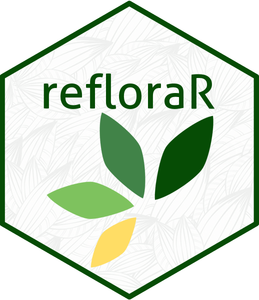

<!-- README.md is generated from README.Rmd. Please edit that file -->

```{r, include = FALSE}
knitr::opts_chunk$set(
  collapse = TRUE,
  comment = "#>",
  fig.path = "figures/",
  out.width = "100%"
)
```

# refloraR 

<!-- badges: start -->
[](https://app.codecov.io/gh/DBOSlab/refloraR)
[](https://github.com/DBOSlab/refloraR/actions/workflows/test-coverage.yaml)
[](https://cran.r-project.org/package=refloraR)
[](https://github.com/DBOSlab/refloraR/actions/workflows/R-CMD-check.yaml)
[](LICENSE)
<!-- badges: end -->


`refloraR` is an R package for accessing and analyzing plant specimen data from the [REFLORA Virtual Herbarium](https://reflora.jbrj.gov.br/reflora/herbarioVirtual/), hosted by the [Rio de Janeiro Botanical Garden](https://www.gov.br/jbrj/pt-br). It provides tools for downloading, summarizing, and filtering herbarium records in Darwin Core Archive (DwC-A) format via the [REFLORA IPT](https://ipt.jbrj.gov.br/reflora/).


## Installation

You can install the development version of `refloraR` from [GitHub](https://github.com/DBOSlab/refloraR) with:

``` r
# install.packages("devtools")
devtools::install_github("DBOSlab/refloraR")
```

```r
library(refloraR)
```
\
\

## Usage

A general description of the available main functions (`reflora_download` and `reflora_summary`) that extract original REFLORA collections are provided below.\
\

#### _1. `reflora_summary`: Summarizing REFLORA collections_

The following code can be used to extract a summary of all REFLORA-associated collections, including herbarium acronym, curator's email contact, number of records and a direct link to the original REFLORA Integrated Publishing Toolkit ([IPT](https://ipt.jbrj.gov.br/reflora)).\
```r
library(refloraR)

summary_df <- reflora_summary(verbose = TRUE,
                              save = TRUE,
                              dir = "reflora_summary")
```
\
By specifying a vector of herbarium acronyms, the user can extract a summary for just the specific herbarium collection.\

```r
summary_some_df <- reflora_summary(herbarium = c("ALCB", "RB", "HUEFS", "US", "K"),
                                   verbose = TRUE,
                                   save = TRUE,
                                   dir = "reflora_summary")
```
\
\

#### _2. `reflora_download`: Downloading REFLORA specimen records_

The following code can be used to download original specimen records in DwC-A format and associated metada for all REFLORA collections.\

```r
library(refloraR)

reflora_download(verbose = TRUE,
                 dir = "reflora_download")
```
\
By specifying a vector of herbarium acronyms, the user can download specimens records for just the specific herbarium collection.\

```r
reflora_download(herbarium = c("ALCB", "HUEFS", "RB", "US", "K"),
                 verbose = TRUE,
                 dir = "reflora_download")
```
\
\

## Documentation
Full function documentation and articles are available at the `refloraR` [website](https://dboslab.github.io/refloraR-website/).\
\

## Citation
Cardoso, D. & Calderón, C. 2025. _refloraR_: An R Package for Exploring Plant 
Specimen Collections from REFLORA Virtual Herbarium. https://github.com/dboslab/refloraR

