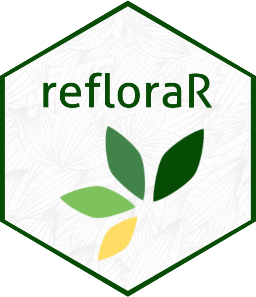

<!-- README.md is generated from README.Rmd. Please edit that file -->

# refloraR 

<!-- badges: start -->

[](https://app.codecov.io/gh/DBOSlab/refloraR)
[](https://cranlogs.r-pkg.org/badges/grand-total/refloraR)
[](https://github.com/DBOSlab/refloraR/actions/workflows/R-CMD-check.yaml)
[](https://img.shields.io/badge/license-MIT-blue.svg)
<!-- badges: end -->

An R package for exploring plant specimen collections from [REFLORA
Virtual Herbarium](https://ipt.jbrj.gov.br/reflora) hosted by [Rio de
Janeiro Botanical Garden](https://www.gov.br/jbrj). The package
interacts with the REFLORA Integrated Publishing Toolkit (IPT) by
readily downloading full specimen records for any herbarium in Darwin
Core Format. Also, the package has specific functions to summarize
information and filter specific information by taxonomic or geographical
search.

## Installation

You can install the development version of ***refloraR*** from
[GitHub](https://github.com/DBOSlab/refloraR) with:

``` r
# install.packages("devtools")
devtools::install_github("DBOSlab/refloraR")
```

``` r
library(refloraR)
```

  
  

## Usage

A general description of the available main functions
(`reflora_download` and `reflora_summary`) that extract original REFLORA
collections are provided below.  
  

#### *1. `reflora_summary`: Summarizing REFLORA collections*

The following code can be used to extract a summary of all
REFLORA-associated collections, including herbarium acronym, curator’s
email contact, number of records and a direct link to the original
REFLORA Integrated Publishing Toolkit
([IPT](https://ipt.jbrj.gov.br/reflora)).  

``` r
library(refloraR)

summary_df <- reflora_summary(verbose = TRUE,
                              save = TRUE,
                              dir = "reflora_summary")
```

  
By specifying a vector of herbarium acronyms, the user can extract a
summary for just the specific herbarium collection.  

``` r
summary_some_df <- reflora_summary(herbarium = c("ALCB", "RB", "HUEFS", "US", "K"),
                                   verbose = TRUE,
                                   save = TRUE,
                                   dir = "reflora_summary")
```

  
  

#### *2. `reflora_download`: Downloading REFLORA specimen records*

The following code can be used to download original specimen records in
Darwin Core Format and associated metada for all REFLORA collections.  

``` r
library(refloraR)

reflora_download(verbose = TRUE,
                 dir = "reflora_download")
```

  
By specifying a vector of herbarium acronyms, the user can download
specimens records for just the specific herbarium collection.  

``` r
reflora_download(herbarium = c("ALCB", "HUEFS", "RB", "US", "K"),
                 verbose = TRUE,
                 dir = "reflora_download")
```

  
  

## Documentation

A detailed description of the ***refloraR***’s full functionality is
available in different
[articles](https://dboslab.github.io/refloraR/).  
  

## Citation

Cardoso, D. & Caldéron, C. (2024). *refloraR*: An R package for
exploring plant specimen collections from REFLORA Virtual Herbarium.
<https://github.com/dboslab/refloraR>
